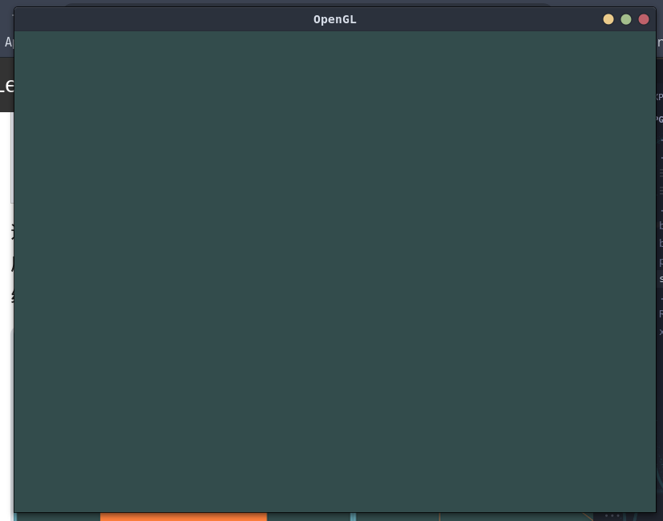
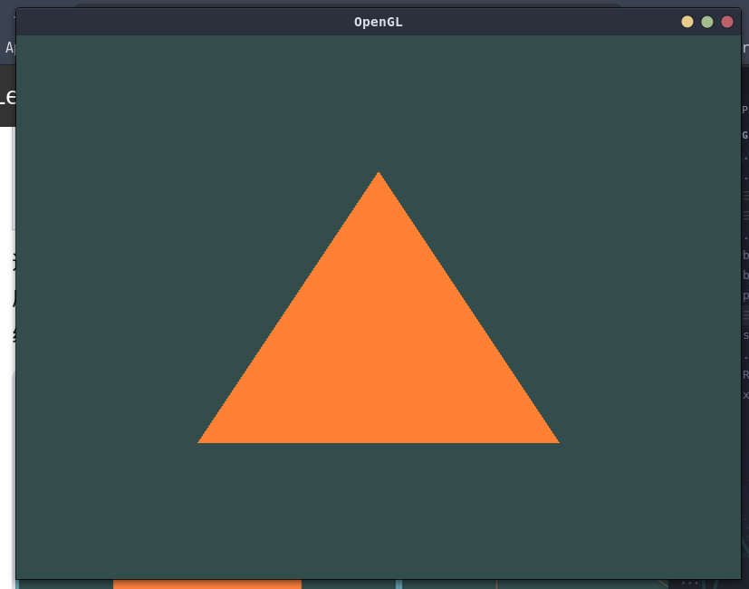
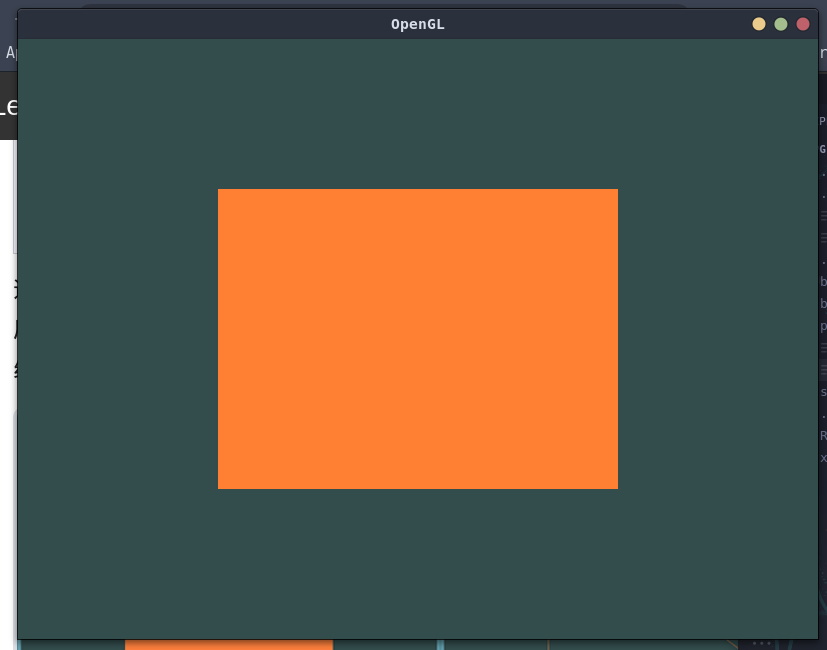

# OpenGL

platform: `Fedora`
code tool: `vscode`
package manager: `xmake`

pre install

```bash
xrepo install glfw
xrepo install glad
```

and then the setting referencing `xmake.lua`.

- `window.cpp`: the minimum runnable application
  
- `triangle.cpp`: working flow for drawing a triangle (VAO, VBO)
  
- `rectangle.cpp`: working flow for drawing a rectangle (EBO)
  
- `glsl.cpp`: shader programming
  
- `texture.cpp`: add texture
  
- `3d`: use `glm` to transform/rotate the object, more like 3d object.
  
  
- `camera.cpp`: move the camera
  
- `color.cpp`, `lighting.cpp`: Defines the color of an object and light, and combines ambient light and specular intensity components to determine the visual output of the object
  
- `multiplelight.cpp`: multiple light object, direct light, point light, spot light
  
